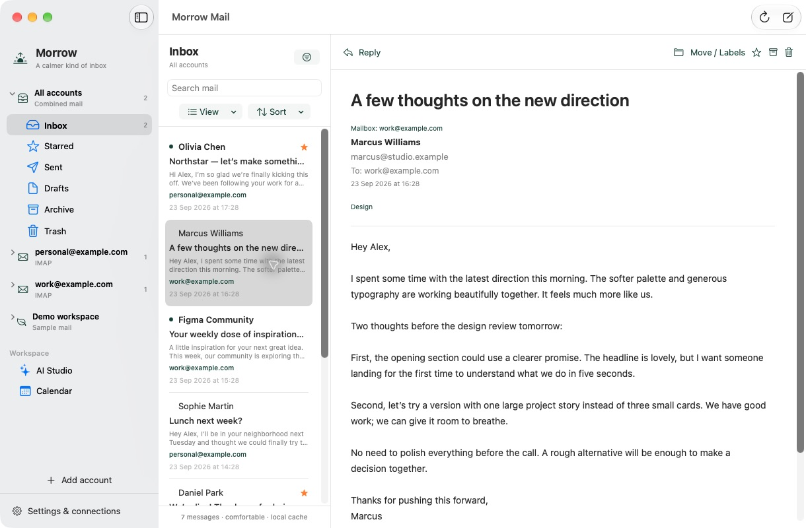
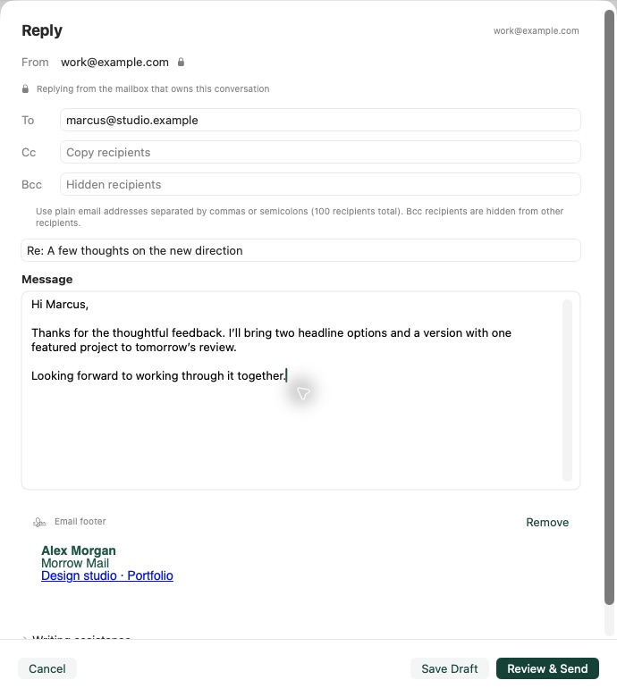

# Morrow Mail

**An open-source email client for macOS and Windows, with calendars and your choice of AI.**

[](https://github.com/Coke1120/genmail/actions/workflows/check.yml)
[](LICENSE)
[](#windows-desktop-app)
[](#native-macos-app)
[](https://github.com/Coke1120/genmail/releases)

[Download macOS / Windows alpha](https://github.com/Coke1120/genmail/releases) · [Feature coverage](FEATURE_COVERAGE.md) · [Verification](VERIFICATION.md) · [GitHub Sponsors](https://github.com/sponsors/Coke1120) · [Buy Me a Coffee](https://buymeacoffee.com/Coke1120)

Morrow Mail is an independent, MIT-licensed alternative inspired by Genspark GenMail. It runs locally with a **fully native SwiftUI macOS interface** and a **React / Electron Windows desktop interface**. Both bundle the same mail service and use the same release version. The React interface also runs in a browser for development.

- **Multiple mailboxes:** Gmail, Outlook / Microsoft 365, and IMAP / SMTP; combined or separate inboxes with collapsible account groups, sorting, and compact views.
- **Mail and calendars together:** read, search, compose, reply, manage provider folders / Gmail labels, and connect Google Calendar and Outlook Calendar.
- **Bring your own AI:** configure a custom base URL, model ID, and API key for an OpenAI-compatible endpoint or use Ollama. Enable individual AI behaviors and choose what context they can access.
- **Controlled AI automation:** GitHub update checks, daily/interval P0–P4 summaries, opt-in arrival/open/reply triggers, separate response/translation languages, and reviewed writing-style learning.
- **History on your terms:** 1/3/6/12-month Inbox/Sent imports, pause/resume, body-only style samples and a per-analysis token budget.
- **Native composition:** To / Cc / Bcc, multiple recipients, replies bound to the receiving account, HTML email footers, keyboard shortcuts, and standard macOS window controls.

AI Studio covers 19 behaviors through model-backed assistance and clearly labeled local simulations. Sending always requires an explicit action; AI does not send email automatically. Local storage does not mean every operation stays offline: connected mail/calendar providers and your configured AI endpoint receive the data needed for enabled actions.

This project is not affiliated with Genspark and does not claim complete parity. See [feature coverage](FEATURE_COVERAGE.md) for implementation status and simulation limits, and [verification](VERIFICATION.md) for completed checks and remaining release validation.

## Screenshots

Captured from the 0.4 development build using fictional messages and isolated provider fixtures. No private mail is shown. These macOS screens show the interface included in the 0.4 alpha line. Windows uses the React interface; it is not a SwiftUI port.

**Combined inbox with collapsible account groups and per-message mailbox labels**



**Reply from the receiving account, with Cc / Bcc and an HTML footer**



## Download the alpha

[Download the latest paired alpha and checksums](https://github.com/Coke1120/genmail/releases). Starting with **v0.4.0-alpha.1**, each release contains both:

| Platform | Package | Interface |
| --- | --- | --- |
| macOS 13.5+, Apple silicon | `Morrow-Mail-<version>-macos-arm64.zip` | Native SwiftUI |
| Windows 10/11, x64 | `Morrow-Mail-<version>-windows-x64.zip` | React in an isolated Electron window |

Both include their runtimes; no Node installation is needed. On macOS, unzip and move **Morrow Mail.app** to Applications. On Windows, extract the **entire folder** and run **Morrow Mail.exe**; keep the accompanying files together.

These are experimental alphas. macOS builds are **ad-hoc signed, not Apple notarized**; Windows builds are **unsigned** and may show SmartScreen warnings. Review the source and supplied SHA-256 checksum before opening. For macOS, see Apple's [opening an app from an unidentified developer](https://support.apple.com/guide/mac-help/open-a-mac-app-from-an-unidentified-developer-mh40616/mac) instructions. Stable distribution signing and live-account acceptance remain pending.

## v0.5 alpha scope

This release adds controlled AI automation, historical import and reviewed writing-style learning to both desktop clients. Future work includes large-mailbox UI pagination/full delta sync, app-wide AI usage budgets, attachment support and delayed/undo sending. These are roadmap items, not capabilities of this release. See [verification](VERIFICATION.md) for release checks and acceptance limits.

## Native macOS app

The primary interface is **fully native SwiftUI**, including the mail reader, composer, all 19 AI Studio tools, skills, Email Brain, settings, permissions, and Google/Outlook calendars. There is no embedded web view. The app bundles Node and the existing mail service so it runs without a terminal or a separately installed Node runtime.

Build on a Mac with Apple's Swift command-line tools, Node.js 22.13+, and npm:

```sh
npm ci
npm run check
npm run macos:test
npm run macos:build
npm run macos:open
```

The result is `build/macos/Morrow Mail.app`. You can move it to Applications. The build uses the host architecture; this build is Apple silicon and requires **macOS 13.5+** because of its bundled Node runtime. `macos:build` rejects Node distributions linked to non-system libraries and records the bundled runtime's minimum OS in the app. Use an official standalone Node distribution when building elsewhere.

Native data lives in `~/Library/Application Support/Morrow Mail`, separate from the web app's `./data`. Existing web data is not automatically moved. To reuse it, stop both apps, make a verified backup, and restore that backup's database and encryption key into the native data directory before opening the native app. `MORROW_DATA_DIR` can select a separate absolute data directory for development or acceptance testing. Do not run two apps against the same data directory.

The app starts its own loopback service on a random free port and authenticates native API requests with a per-launch secret sent over a private pipe. OAuth browser handoffs use the same PKCE/state/cookie checks as the web app. When the build includes Morrow’s Google registration, click **Sign in with Google in browser** without entering a client ID or secret. **Use my own Google OAuth client** is available under advanced settings. Outlook still requires your own Microsoft client ID. Keep Morrow open until sign-in finishes; returning to the app refreshes connections and selects the newly connected mailbox. **Do not open the callback URL manually**: it is only the return address after provider authorization. It is available under **Advanced: callback URL for app registration** in native Settings, with a copy button. The fixed `:3001` examples below describe the web app. Google desktop clients accept loopback ports. Microsoft [ignores the port when matching localhost redirect URIs](https://learn.microsoft.com/en-us/entra/identity-platform/reply-url#localhost-exceptions); register each mail/calendar callback path separately.

Keyboard shortcuts: **⌘N** compose, **⌘,** Settings, **⌘F** search, **⌘R** sync, **⌘⇧R** reply, **⌘⇧M** provider Move / Labels, **⌘⇧A** local archive, **⌘⇧U** local read/unread, and **⌘1/2/3** Inbox / AI Studio / Calendar. In the composer, **⌘S** saves a draft and **⌘⇧D** opens send review. **Esc** cancels. Standard macOS **⌘M**, **⌘W**, **⌃⌘F**, and the red/yellow/green title-bar controls minimize, close, resize, and enter full screen. **Window → Window Size** offers compact, standard, and wide sizes; the window also resizes by dragging its edges and restores its saved size.

The inbox's **View** menu selects Compact, Comfortable, or Spacious rows. **Sort** offers newest, oldest, sender, subject, unread-first, and starred-first; both choices persist across launches and apply to individual and combined views. Unsaved drafts/settings/notes are guarded when closing or quitting; in-flight writes must finish before quitting. Preferences include native light/dark/system appearance and mail density.

Native **Settings → About → Back Up Workspace** creates a verified backup including any pending calendar request. Calendar creation persists its original request ID and details before writing to the provider, so a restart can recover an uncertain attempt. Review the provider's calendar before resolving a pending request.

Builds are ad-hoc signed for local use. A stable public distribution requires your Apple Developer ID certificate, hardened-runtime signing and **Apple notarization**. The published alpha explicitly remains unnotarized. Set `MORROW_SIGNING_IDENTITY` to your Developer ID identity for signing; the script does not submit anything to Apple. The app is not App Store sandboxed. Live provider acceptance testing and signing/notarization are release requirements, not claims made by the local build.

## Windows desktop app

The Windows package reuses the React interface and the same provider, account-routing, AI-permission and calendar service as macOS. It has standard minimize/maximize/close controls, remembered window size, and an isolated renderer with no Node access. The bundled backend uses a fresh loopback port and private bearer token on every launch; credentials and the token are not exposed through the desktop bridge.

Data lives in `%APPDATA%\Morrow Mail`. Sidebar disclosure and pending calendar requests persist across app restarts. Windows uses the current user's profile permissions; Unix file-mode checks do not represent Windows ACLs. Account data is local to each installation; paired releases do **not** synchronize mail caches, credentials or preferences between computers.

The **Sign in … in browser** button opens the system browser. Keep Morrow open, finish authorization, then return to Mail or Calendar Settings. Connections refresh on return when there are no unsaved edits or in-flight operations; **Refresh connections** remains available. The callback in Advanced settings is for provider registration, not a link to start login. Keyboard shortcuts include **Ctrl+N** compose, **Ctrl+F** search, **Ctrl+,** settings, **Ctrl+R** sync, **Ctrl+Shift+R** reply, **Ctrl+1/2/3** Inbox / AI Studio / Calendar, **Ctrl+S** save draft, and **Ctrl+Shift+D** send review.

Build on Windows x64 with official Node.js 22.13+ and npm:

```sh
npm ci --ignore-scripts
npm run check
npm run windows:build
npm run desktop:test -- --packaged
node scripts/package-release.js
```

The runnable folder is `build/windows/Morrow Mail-win32-x64`; the distributable ZIP and SHA-256 checksum are in `build/release`. The packaged smoke test uses a fresh temporary demo workspace and sends no real mail. Desktop-shell development can be checked on a Mac with `npm run build` followed by `npm run desktop:test`; this does not replace Windows verification.

For a Windows backup, quit Morrow Mail, open PowerShell inside the extracted app folder, and run:

```powershell
$env:DATA_DIR = Join-Path $env:APPDATA 'Morrow Mail'
& '.\resources\app\runtime\node.exe' '.\resources\app\backend\scripts\backup.js' 'C:\path\to\new-backup-folder'
```

## Keeping platform releases aligned

`package.json` is the version source for both apps and archive names. Pushes and pull requests run backend/web checks on Ubuntu, macOS and Windows. macOS also compiles and tests SwiftUI; Windows builds and launches its packaged `.exe`. Tag and manually dispatched builds upload both packages as short-lived CI artifacts; published release downloads remain available.

To publish a new alpha, update the changelog and verification notes, bump the package version with `npm version <version>-alpha.<number> --no-git-tag-version`, commit, then push the matching `v<version>-alpha.<number>` tag. The workflow builds both platforms from that **same tag**. It verifies both archives and their checksums, uploads them to a draft release, and makes the release public only after every platform job succeeds. Failed builds publish no partial release; failed uploads leave a draft. Published assets are never overwritten.

Every change is checked; versioned tags publish paired downloads. Unsigned automation currently accepts alpha versions only. Native UI differences remain explicit in [feature coverage](FEATURE_COVERAGE.md); API changes must preserve both clients.

## Web development interface

Requires **Node.js 22.13 or newer** and npm. SQLite is built into Node; no database service is needed.

```sh
cd ~/Documents/Github/genmail
npm install
npm run dev
```

Open <http://localhost:5173>. The API runs at <http://localhost:3001>. The demo inbox works without credentials.

For a checked production build served locally:

```sh
npm ci
npm run check
npm start
```

Open <http://localhost:3001>. The server binds to loopback (`127.0.0.1`). Check its health with `curl --fail http://localhost:3001/api/health`. Run tests separately with `npm test`; `npm run check` runs tests and the production build.

This deployment is a local, single-user process. Public hosting and shared access are not supported; a production build does not add user authentication or establish production certification. Live provider acceptance testing still requires your own accounts.

## Connect a mailbox

Open **Settings → Mail** and select a provider. Connect as many mailboxes as you need, including multiple accounts from the same provider. Use **Add Another Account** for the next connection. Builds can include Morrow’s Google Desktop OAuth registration for Gmail and Google Calendar. Those builds show a Google sign-in button without credential fields; custom Google registrations remain an advanced option. Source builds without this configuration and Outlook require your own app registration. Authorization and token exchange run locally; there is no hosted OAuth service.

The native sidebar includes **All accounts** with combined folders, then separate folders under each connected email address. Both clients group folders under each account. All accounts, individual accounts and Demo can be collapsed independently; each client remembers its disclosure state. Combined mail defaults to newest first and supports the selected sort order and shows each message’s mailbox. The sample **Demo workspace** stays separate and is never mixed into real mail.

**From** chooses the account for a new message. Replies, saved drafts, and uncertain deliveries stay with their original account. AI actions on a selected message use that message’s mailbox; choose an individual account for mailbox-wide AI Studio tools, skills, and Email Brain. No AI request combines account histories.

Sync refreshes the selected mailbox, or every connected mailbox from **All accounts**. A failure in one combined sync is reported while successful accounts keep their updates. Disconnect removes only the chosen account’s credentials. Cached mail, drafts, and account-specific workspace records remain on this Mac and return when the same email address reconnects. Disconnected accounts are excluded from combined views. Reconnecting an existing address updates its connection rather than adding a duplicate.

Existing single-mailbox installations are supported automatically, preserving their connection and cached mail. The last selected view is restored on restart; each message action carries its own account identity so switching views cannot redirect a draft or send.

### Gmail

If Settings says **Google sign-in is ready**, click the browser sign-in button. The publisher manages the Cloud setup below; ordinary users do not need to register an app. The existing public `v0.5.0-alpha.1` downloads predate this built-in sign-in change. These setup steps apply to publishers, source builds, and the advanced custom-client option:

1. Create or select a project in [Google Cloud Console](https://console.cloud.google.com/) and enable the **Gmail API**.
2. Configure the OAuth consent screen. For an external app in testing, add your Google account under **Test users**.
3. To enable provider moves, check **Allow moving mail and managing labels** in Settings and configure `https://www.googleapis.com/auth/gmail.modify`. Without that option, configure these scopes: `https://www.googleapis.com/auth/gmail.readonly`, `https://www.googleapis.com/auth/gmail.send`, `openid`, and `email`.
4. Create an OAuth client with application type **Desktop app**. Copy its client ID and client secret into Morrow's Gmail settings, then connect and sign in.

The local callback is `http://localhost:3001/api/oauth/google/callback`. Desktop clients use a loopback callback; they do not use the web-client redirect URI configuration.

Google external apps in testing receive [refresh tokens that expire after seven days](https://developers.google.com/identity/protocols/oauth2#expiration) for these Gmail scopes, requiring reconnection. Publishing an app for other users can require Google's verification process. See the [Gmail API setup guide](https://developers.google.com/workspace/gmail/api/quickstart/nodejs) and [desktop OAuth documentation](https://developers.google.com/identity/protocols/oauth2/native-app).

### Google registration for desktop builds

Provide a downloaded **Desktop app** OAuth JSON file when packaging, for example:

```sh
MORROW_GOOGLE_OAUTH_FILE=/absolute/path/google-desktop-client.json npm run macos:build
```

The Windows builder accepts the same environment variable. CI uses the repository Actions secret **`GOOGLE_DESKTOP_OAUTH_JSON`** for both platforms; tagged builds fail if it is missing. Local/fork builds without a build input keep the custom-client flow. The JSON must contain an `installed` client; web-client credentials are rejected.

The build embeds only the Desktop client ID and secret in the private backend bundle, not the renderer or public API. Installed-app credentials can be extracted from the distributed package and are not confidential server secrets. Never put user access/refresh tokens in this input. The raw downloaded file and generated `google-oauth.json` must stay out of Git.

The publisher must enable Gmail and Calendar APIs, configure the consent screen and test users, and complete any required Google verification. Bundling a client does not verify these Cloud settings or lift Testing restrictions. Users still authorize their own Google accounts in the browser.

### Outlook / Microsoft 365

1. In [Microsoft Entra app registrations](https://entra.microsoft.com/), register an application. Select **Accounts in any organizational directory and personal Microsoft accounts** to support both work/school accounts and personal Outlook accounts.
2. Under **Authentication**, add the **Mobile and desktop applications** platform with the custom redirect URI `http://localhost:3001/api/oauth/microsoft/callback`. Enable public client flows.
3. Add Microsoft Graph **delegated** permissions `User.Read`, `Mail.Read`, and `Mail.Send`. To enable provider moves, add `Mail.ReadWrite` and check **Allow moving mail and managing labels** in Settings. Reconnect existing accounts after changing permissions. Morrow also requests `offline_access` to refresh the connection.
4. Copy the application/client ID into Morrow's Outlook settings, then connect and sign in. This public desktop client does not require a client secret.

Your organization may require administrator approval for consent or restrict app registration. See Microsoft's [app registration guide](https://learn.microsoft.com/en-us/entra/identity-platform/quickstart-register-app), [platform configuration](https://learn.microsoft.com/en-us/graph/auth-register-app-v2), and [Graph permissions reference](https://learn.microsoft.com/en-us/graph/permissions-reference).

### IMAP / SMTP

Enter your email address, mailbox password or provider-issued app password, and the provider's server names in Settings. Use TLS IMAP, normally port **993**. SMTP supports **465** with TLS or **587** with STARTTLS. Providers must permit password/app-password authentication; use the OAuth options above for Gmail and Outlook.

IMAP retrieves mail; SMTP sends it. Use your provider's documented hostnames instead of guessing them.

## Compose and organize

To, Cc and Bcc accept up to **100 plain email addresses total**, separated by commas or semicolons. At least one address is required across the three fields; Bcc-only sends are supported. Display-name/group syntax is not accepted. Duplicate addresses are delivered once. Cc/Bcc survive saving and uncertain-send recovery. Review shows all recipients; SMTP Bcc stays in the delivery envelope, and Gmail/Outlook receive it in the API MIME submission for provider delivery.

Select an imported message and choose **Move / Labels** (or its context menu). The app loads destinations from that message's account, then requires review before writing:

- **Gmail:** move to a custom label (add it and remove Inbox), return to Inbox, archive, or add/remove a custom label while retaining Inbox status. Other labels remain intact. Reconnect with the organization permission enabled.
- **Outlook:** move to existing folders and nested folders within the same mailbox. Requires delegated `Mail.ReadWrite` permission.
- **IMAP:** move to an existing selectable folder. The server must support **MOVE and UIDPLUS**; Morrow validates UID validity and retains the destination UID to avoid acting on a different message.

The destination limits are 1,000 Gmail labels and 300 Outlook/IMAP folders. Creating/deleting folders or labels, cross-account transfers, bulk moves, and full destination-folder synchronization are not included. Moved cached messages outside Inbox appear under local Archive, with their provider location in the reader. These manual provider writes are separate from local read/star/archive/trash shortcuts and AI Studio simulations. A failed or lost response requires checking the provider before trying again; there is no automatic move retry.

Provider semantics: [Gmail modify](https://developers.google.com/workspace/gmail/api/reference/rest/v1/users.messages/modify), [Outlook move](https://learn.microsoft.com/en-us/graph/api/message-move?view=graph-rest-1.0), and [Outlook immutable IDs](https://learn.microsoft.com/en-us/graph/outlook-immutable-id).

## Connect calendars

Open **Settings → Calendar** to connect providers, or use **Connections** on the separate Calendar page. You can connect **Google Calendar and Microsoft Calendar at the same time**, independently of your mail accounts. Calendar connections currently support one Google account and one Microsoft account; each can expose multiple calendars. These are live connections even when the mailbox is in demo mode. Select a provider and calendar, then load events for a date range of up to **90 days**.

Creating an event requires entering its details and reviewing the destination calendar, date, and time before explicitly submitting it. Events are created without attendees; Morrow does not send invitations. Calendar access is separate from AI Studio: its simulated scheduling and meeting-preparation features do not read these live calendars or create live events.

### Google Calendar

A build with Google sign-in configured uses the same built-in Desktop client as Gmail. Choose **Sign in with Google in browser** in Calendar settings; calendar consent remains separate from mail consent. The following setup is for the publisher or a custom-client user:

1. In your Google Cloud project, enable the **Google Calendar API**. You can reuse the Gmail project's **Desktop app** OAuth registration.
2. Configure the consent screen and add your account as a test user when the app is in testing.
3. Add `openid`, `email`, `https://www.googleapis.com/auth/calendar.calendarlist.readonly`, and `https://www.googleapis.com/auth/calendar.events` to the app's requested scopes.
4. Enter the desktop client ID and secret in **Settings → Calendar → Google Calendar** and sign in.

The calendar callback is `http://localhost:3001/api/calendar-oauth/google/callback`. Desktop clients use the local loopback callback rather than a web-client redirect list. These calendar scopes permit listing calendars and reading/writing events; the seven-day testing-token caveat described above also applies. See Google's [Calendar setup guide](https://developers.google.com/workspace/calendar/api/quickstart/nodejs) and [Calendar scopes](https://developers.google.com/workspace/calendar/api/auth).

### Microsoft Calendar

1. Create or reuse a Microsoft Entra app registration that supports **work/school and personal Microsoft accounts**.
2. Under **Authentication → Mobile and desktop applications**, add `http://localhost:3001/api/calendar-oauth/microsoft/callback` and enable public client flows. Keep the mail callback too if using the same app for Outlook mail.
3. Add Microsoft Graph **delegated** permissions `User.Read` and `Calendars.ReadWrite`. Morrow also requests `offline_access` for refresh tokens.
4. Enter the application/client ID in **Settings → Calendar → Outlook Calendar** and sign in. No client secret is required.

An organization may require administrator approval. Microsoft's [event creation documentation](https://learn.microsoft.com/en-us/graph/api/user-post-events?view=graph-rest-1.0) confirms the delegated permission and explains that adding attendees sends invitations; Morrow's creation flow does not include attendees. See the [Graph permissions reference](https://learn.microsoft.com/en-us/graph/permissions-reference) for scope details.

## Connect AI

In **Settings → Model**, enter your own OpenAI-compatible **base URL**, **model ID**, and **API key**. The key is optional for endpoints that do not require one. Configure the output token limit and temperature for models that support those parameters.

**Test connection** sends a fixed test prompt with no email content and does not save your changes. Save separately. Blank API-key input retains the saved key only when the base URL is unchanged; changing the endpoint requires its own key. Use the remove-key control to clear it.

For a local [Ollama](https://ollama.com/) model:

```sh
ollama pull qwen3:8b
```

Use base URL `http://127.0.0.1:11434/v1` and model `qwen3:8b` while Ollama is running. You can substitute another model you have installed. Remote providers must use HTTPS and may require an API key.

Summaries, replies, inbox questions, writing, rewriting, translation, briefings, and custom skills use the configured model when invoked. Without a model, the demo inbox returns labeled illustrative results; model-backed assistance for a connected mailbox requires a configured model.

## Permissions and settings

**Settings → AI permissions** has a master switch and a checkbox for every behavior. Choose permitted folders, message fields, contextual data, and the maximum message count. These permissions are enforced on the server before AI or simulation input is assembled; unchecked fields are excluded from context and search. Turning off AI leaves manual reading, composing, sending, and Calendar-page actions available.

Model settings, permissions, and general preferences are **global across accounts**, including demo. Mail, drafts, skills, and workflow records belong to an individual account. Folder permissions apply to locally cached messages. Choose Inbox/Sent import separately in Mail settings; enabling a scope alone does not download a folder. Archive import is not implemented.

General settings include your display name, plain-text or HTML signature, theme, density, mark-read-on-open behavior, reply tone, preferred AI response language, independent target translation language (blank follows the preferred language), and sync interval. These language settings control AI output, not UI localization. Timed mail sync checks all connected accounts every 1, 5, 15 or 30 minutes while the service is running; it defaults to manual. Review generated text before inserting it into a draft.

**Settings → About → Check for updates** checks public releases in `Coke1120/genmail` on GitHub. Alpha builds initially include alpha/beta releases; uncheck that option to check stable releases only. The app compares semantic versions among the latest 100 published releases, shows the installed/latest version and check time, and opens the release downloads page. Checks share no mail or credentials, time out after 10 seconds, and cache successful results for one minute. Offline, rate-limit and empty-channel responses are shown as errors, not as “up to date.” Download and installation are manual.

**Settings → AI permissions → When assistance starts** provides four independent, default-off triggers:

- Summarize when a message opens.
- Suggest text when a new, empty reply opens. Saved drafts and uncertain sends are excluded; inserting text requires a click and preserves recipients and the footer.
- Summarize newly synced messages. Runs after manual or automatic sync discovers new provider IDs; connecting/reconnecting does not summarize the initial imported inbox. This is polling, not provider push. Use General → Refresh all connected inboxes for automatic checks.
- Generate scheduled summaries: daily at a 24-hour time in a saved IANA time zone (for example `09:00`, `Asia/Hong_Kong`), or every **1–168 whole hours**. Results appear under **AI Studio → Summaries**; completed arrival summaries also appear in the message reader.

**Only messages in Inbox** (default on) and **Only starred messages** must both match when checked. Behavior, folder and content permissions also apply before context reaches the model. Drafts and Trash are excluded. Settings apply globally but jobs and results remain account-specific, including in combined views. Demo jobs run only when no real mail account is connected. No trigger sends mail, inserts drafts, creates events, moves mail, or updates Email Brain automatically. Remote models may charge for requests. Opening messages/replies again can make another request; overlapping identical UI requests are coalesced. The reader reuses a retained, valid arrival summary when available.

Scheduled jobs use the **newest cached permitted messages, capped at Maximum messages per request (8 by default, 50 maximum)**. They are a bounded digest, not an exhaustive inbox audit. Each automatic report validates one P0–P4 classification per included message: **P0 explicit emergency; P1 explicit action due today; P2 normal action/follow-up or unclear urgency; P3 information; P4 bulk/promotional**. The selected time zone defines today. These are AI suggestions, never a guarantee of urgency. Models must return valid JSON with every source ID; incomplete output fails rather than showing a partial report. Increase response tokens or reduce the context limit if needed. Demo reports are clearly illustrative and do not perform real priority analysis.

The local service checks schedules every 30 seconds, processing at most four queued model calls serially per tick. Both desktop clients use this same scheduler. The app must remain running; browser development uses the running server. After sleep/restart a daily schedule catches up once for the current day, not every missed day; intervals use persisted attempt times and do not replay missed intervals. Changing/enabling the schedule resets its timing. Daily jobs run at most once per local date, including DST repeated hours; a missing DST time runs after the gap. Failed or interrupted calls are not automatically retried, because they may already have spent tokens. Generate a manual briefing if needed.

The queue holds at most 100 pending jobs per account, retains up to 20 completed/failed/interrupted reports, and shows a counter for overflow requiring manual handling. Summaries displays the latest 20 jobs; it refreshes every 30 seconds when the client is idle and has a manual Refresh button. Results are hidden/discarded when model, AI language/tone, policy, owning connection or permitted source content changes. Turning off triggers keeps manual AI available. No OS notification or system background service is installed.

### Historical import and writing-style learning (v0.5 alpha)

In **Settings → Mail**, choose **1, 3, 6 or 12 calendar months** (default 3) and select **Inbox**, **Sent**, or both before connecting. Existing accounts can use **Start chosen import**. This downloads mail locally without any AI calls. Progress, pause and resume are per account; read-only pages checkpoint to disk and resume after restart. Refresh progress in Settings. Importing a shorter range never deletes cached mail. Historical import does not generate new-mail summaries. IMAP Sent requires the server to advertise its `\Sent` special-use folder; if unavailable, select Inbox only or configure Sent on the provider. Large IMAP messages still use the existing 5 MB body ceiling. Gmail/Outlook page tokens and IMAP UIDVALIDITY are checked; a changed IMAP folder requires a fresh import.

In **Settings → Learning**, select an individual connected account and optionally enable **Learn my writing style**. This requires the global AI switch, Email Brain behavior, Sent scope and body permission. It does **not** require Contacts, Subject or Sender permission: only cleaned body samples go to the model; ownership and diversity selection happen locally. Contact/project notes remain separate. Learning can be skipped entirely.

1. Save the learning range, sample cap (**1–50**) and per-analysis token budget (**4,000–64,000**, default **16,000**). The global **Maximum messages per request** also applies (default 8; raise it explicitly if desired).
2. **Preview samples** uses no AI. It filters sent mail authored by the account, excludes recognized automatic mail, deduplicates normalized text and alternates date/recipient buckets. Common quotes, forwarded chains, signature delimiters and disclaimers are stripped heuristically. Review the exact sample text; unusual formatting may remain. Individual samples are capped at 6,000 characters.
3. Review useful/sample counts and the conservative **UTF-8-based token estimate**, including request framing and output allowance, then choose **Analyze these samples**. This estimate is not a custom-model tokenizer or a monetary spending guarantee. Provider-reported token usage is shown when supplied.
4. Edit the proposed style and choose **Save approved style**. Only then can it inform writing/reply/rewrite requests, while the relevant permissions and source scope still allow it. This creates prompt context, not fine-tuned model weights. Delete the learned style to remove the profile/preview and turn learning off; original mail remains.

Optional **weekly analysis** runs at most once per seven elapsed days while the service is open, using only newly dated Sent mail since the last successful analysis (or weekly opt-in). It uses cached mail; enable periodic mail refresh to capture messages sent in another app. Pending review pauses the next run. Newly proposed styles never overwrite the approved style automatically. Failed or interrupted model calls are not replayed automatically; another manual request or a later weekly run may incur new usage. Changing model, permissions, connection or source content invalidates a pending result. Only the current preview and approved profile are retained, not an unlimited audit history.

Large caches are still loaded into the current mailbox interface as a whole; import pagination is not UI virtualization. Very large mailboxes need further performance/acceptance work before broad production deployment.

Recommended starting point: daily **09:00**, Inbox only, preferred language **繁體中文**; leave the translation target blank or set **English** independently. Enable new-mail summaries and one-minute sync only if the volume/cost suits you; starred-only further narrows eligibility. Email Brain contact/project notes remain manual or simulated. Separate, opt-in writing-style analysis is available in Settings → Learning and always requires review before applying a style. Genspark's [official GenMail introduction](https://www.youtube.com/watch?v=i9I4frhlD80) confirms morning briefings and learning voice/contacts, but does not document its precise memory-refresh cadence, per-message triggers, or P0–P4 rules. Morrow's rules above are its own implementation.

The Windows/browser reader starts a summary only after you select a message (including previous/next navigation), not when it merely displays the default first-message preview at launch or after sync.

In **Settings → General → Email footer**, choose Plain text or HTML, enter the signature, preview it, then save. One workspace signature applies to new messages, replies and AI-created drafts across your accounts. HTML allows bold/italic/underlined text, limited inline colors and font sizes, lists, tables, and HTTPS/mailto/tel links. Images, scripts, active content, remote resources and unsupported styling are removed. Each draft keeps its own footer snapshot, visible in the composer and removable before sending. Editing settings or replacing the body with an AI suggestion does not change that snapshot. Gmail, Outlook and SMTP send HTML footers as multipart mail with a generated plain-text alternative. Legacy saved drafts keep their original text without an extra footer.

Replies, including AI replies and the native Reply shortcut, keep the account that owns the original message even in combined views or when the To address is an alias. Their From identity is locked; replying to a sent message uses its original recipients.


## AI Studio simulations

Priority previews, smart labels, Email Brain, person/company research, meeting preparation, follow-ups, meeting scheduling, cleanup, unsubscribe, attachment comparisons, and batch replies are **local simulations**, even with a model configured. Preview a plan, then apply it to create local changes or records. Custom skills save editable instructions and run through the configured model or labeled demo mode.

Simulations do not browse the web, contact a calendar, send invitations or messages, unsubscribe with a provider, or fetch attachments. Attachment examples are fixtures behind an opt-in permission. Calendar and contact permissions here control local simulated context; they do not authorize access to connected calendars or external address books. Studio reminders and events are local records, not scheduled notifications or background jobs.

## Data and configuration

Messages and drafts are stored in SQLite under `./data`. Mail/calendar credentials and tokens are encrypted with AES-GCM using a key in the same directory. Protect and back up **both the database and key**. This is not OS-keychain storage, and someone with access to both can decrypt the secrets. Message contents are stored locally in plaintext.

If delivery becomes uncertain, Morrow retains the draft and its request ID. Check your provider’s Sent folder before explicitly retrying; a retry can send a duplicate. Morrow does not automatically retry sending.

Sync communicates with the configured mail provider. Sending transmits your draft through that provider; AI requests transmit relevant emails to your chosen model endpoint. Calendar actions communicate with the selected calendar provider. Credentials are used for their configured provider. Use a local model to keep AI processing on your computer.

| Environment variable | Default |
| --- | --- |
| `PORT` | `3001`, API and production server port |
| `DATA_DIR` | `./data`, runtime database and encryption key |
| `APP_URL` | `http://localhost:5173` in development; `http://localhost:3001` otherwise |
| `NODE_ENV` | Unset; `production` also makes startup reject a missing frontend build |

Set environment variables in your shell, or copy [`.env.example`](.env.example) to `.env` for `npm start` and `npm run backup`. The development launcher uses shell variables. If you change the API port, adjust the development proxy and OAuth callback registration to match; `APP_URL` must remain a loopback HTTP origin. Keep runtime data and credentials out of version control. This app is intended for local single-user use; do not expose it as a shared internet service.

## Backup and recovery

```sh
npm run backup
# Or choose a destination that does not already exist:
npm run backup -- /path/to/new-backup-directory
```

The default destination is `./backups/morrow-<timestamp>`. `DATA_DIR` selects the source directory, just as it does for the server. The backup command can run while Morrow is open: it creates a consistent SQLite snapshot, copies the matching encryption key, and verifies the result. Backup directories/files use owner-only modes on macOS/Linux; on Windows, choose a destination protected by your user ACLs. Copy the resulting directory to your own protected backup storage.

To restore, quit the native app, or stop the web server with Ctrl+C, and wait for shutdown. Preserve the current data directory, then copy **both** `genmail.sqlite` and `encryption.key` from the same backup into a new private directory. Also restore `pending-calendar.json` and `client-state.json` if the backup contains them. Point the web server’s `DATA_DIR` or native app’s `MORROW_DATA_DIR` at it and restart. Verify your saved mail and settings; the web server also exposes `/api/health`. Never replace a key by itself. If taking a manual filesystem copy instead of using the backup command, stop the app first.

Normal startup, health, and backup diagnostics do not include credentials. Keep API keys, tokens, and OAuth callback URLs out of shared issue reports.

## Current limits

- New connections offer **1 / 3 / 6 / 12 months** (default 3), with separate Inbox and Sent selections. Historical pages contain at most 50 messages and continue while the app is open. Existing connections retain latest-50 Inbox sync until a history import is selected. Subsequent refreshes fetch the latest 50 messages per selected folder; full continuous provider delta synchronization is not implemented.
- Read/unread, star, archive, and trash shortcuts are local. The explicit Move / Labels dialog writes to the provider after review; full provider folder synchronization is not implemented.
- Message bodies and incoming mail are plain text. Outgoing HTML footers are supported with a plain-text alternative; full HTML message editing, incoming HTML rendering and real attachments are not supported. Studio attachment examples are simulated.
- Sending from the demo inbox is simulated. Connected accounts send through their configured provider only after you click Send.
- AI summaries can run on an opt-in schedule or newly synced mail while the service is running. Weekly incremental style analysis is a separate per-account opt-in; applying its result remains manual. Unattended sending, automatic reply insertion and autonomous contact/project memory updates are not implemented.
- The Calendar page supports live event reading and explicit event creation without attendees. Editing/deleting existing events, invitations, and automatic scheduling are not implemented. AI Studio scheduling remains a local simulation.
- Calendar reads are bounded to 500 calendars and 1,000 events per request. Use a smaller date range for a busy calendar.
- macOS uses SwiftUI; Windows uses React / Electron. Core features share the same backend, while native controls and layouts differ. iOS and Android apps are not implemented. Windows manual UI acceptance remains pending.
- Provider and model integrations have automated checks with mocks. Authenticated mail, Google/Microsoft Calendar, and remote-model use still require your credentials and consent; they are not claimed as live-account verified or error-free.

## Support development

Donations are optional and do not unlock features: [GitHub Sponsors](https://github.com/sponsors/Coke1120) or [Buy Me a Coffee](https://buymeacoffee.com/Coke1120). The same links appear in Settings → About and GitHub's Sponsor button.

## License

[MIT](LICENSE) © 2026 Morrow Mail contributors.

## Contributing

See [AGENTS.md](AGENTS.md) for the source layout, account-routing rules, and verification commands. Generated bundles, test workspaces, runtime data, and credentials do not belong in source control.
